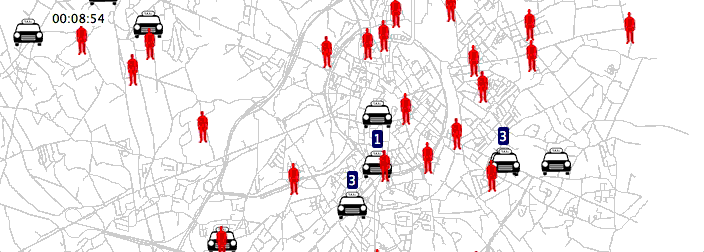
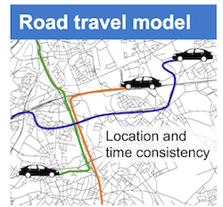
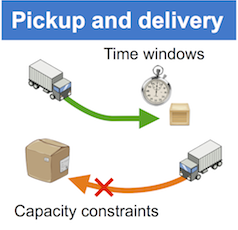

# RinSim 4.2.0-SNAPSHOT

RinSim is an extensible logistics simulator with support for (de)centralized algorithms for pickup and delivery problems and AGV routing. The simulator focuses on __simplicity__ and __consistency__ making it ideal for performing scientific simulations. Further, software quality is a priority resulting in an ever improving test suite and documentation.

[](https://javadoc.io/doc/com.github.rinde/rinsim-core)
[](https://travis-ci.org/rinde/RinSim) 
[](https://maven-badges.herokuapp.com/maven-central/com.github.rinde/rinsim-core)
[](http://dx.doi.org/10.5281/zenodo.58794)

<!--  -->


## Installation

RinSim uses [Maven](http://maven.apache.org/) for managing its dependencies. RinSim can be added to your Maven project by including the following in your pom file, where x and y represents the preferred version number. More __[detailed instructions](docs/howtorun.md)__ are available.
```xml
<dependency>
	<groupId>com.github.rinde</groupId>
	<artifactId>rinsim-core</artifactId>
	<version>4.x.y</version>
</dependency>
```	
Other modules can be added similarly:
```xml
<dependency>
	<groupId>com.github.rinde</groupId>
	<artifactId>rinsim-ui</artifactId>
	<version>4.x.y</version>
</dependency>
<dependency>
	<groupId>com.github.rinde</groupId>
	<artifactId>rinsim-experiment</artifactId>
	<version>4.x.y</version>
</dependency>
```		
For more detailed instructions on how create a Maven project in Eclipse and add RinSim as a dependency see the [instructions](docs/howtorun.md). For release notes of the latest release click [here](releasenotes.md).
 
## Getting Started 
Once the simulator is installed, you are ready to explore the simulator. It is recommended to start by running and studying the [examples](example/README.md). When using Maven in Eclipse, the RinSim JavaDocs are automatically made available making exploration of the code much easier. The remainder of this page gives a high level overview of the simulator. If you have questions or like to stay up to date about RinSim you can subscribe to the mailing list at [this page](https://groups.google.com/forum/?fromgroups=#!forum/rinsim) or ask them on [StackOverflow](https://stackoverflow.com/) (make sure to mention RinSim and the version number that you use).

## About
RinSim is developed at [AgentWise](http://distrinet.cs.kuleuven.be/research/taskforces/agentwise) in the [iMinds-DistriNet group](http://distrinet.cs.kuleuven.be/) at the [Department of Computer Science, KU Leuven, Belgium](http://www.cs.kuleuven.be/). The lead developer is [Rinde van Lon](http://distrinet.cs.kuleuven.be/people/rinde). Valuable contributions were made by Bartosz Michalik and Robrecht Haesevoets.

RinSim is used in both research and education. Several publications rely on RinSim for their experiments and RinSim is used in a course on multi-agent systems as a testbed for students.

## Open source
RinSim is open source under the [Apache License Version 2.0](LICENSE).
From version 3.0.0 RinSim uses [semantic versioning](http://semver.org/), this means that if you are using features introduced in version X.Y.Z it is safe to upgrade to any version greater than X.Y.Z but smaller than X+1.0.0.


## Design Overview

This section gives a brief overview of the most important elements of the simulator. For a deeper understanding you can have a look at the examples, the source code, and the tests.

In RinSim terminology, the parts of the simulation that define the problem and environment are called models, the parts of the simulation that solve the problem (i.e. the solution, the collective adaptive system) are called agents. The design of RinSim allows for easy use and recombination of models to configure a simulation problem. When the problem is configured, the programmer can focus on solving the actual problem by designing a collective adaptive system without having to worry about accidentally violating simulation consistency. Actions that agents can take are considered to be part of the problem not the solution, e.g. a vehicle that can pickup things or can communicate with other vehicles. Actions define the problem space in which a good solution has to be found.

### Simulator

The [Simulator](core/src/main/java/com/github/rinde/rinsim/core/Simulator.java) is the heart of RinSim. Its main concern is to simulate time. This is done in a discrete manner. Time is divided in ticks of a certain length, which is chosen upon initializing the simulator (see examples and code).

Of course time on its own is not so useful, so we can register objects in the simulator, such as objects implementing the  [TickListener](core/src/main/java/com/github/rinde/rinsim/core/model/time/TickListener.java) interface. These objects will listen to the internal clock of the simulator. You can also register other objects, as we will see in a moment.

Once started, the simulator will start to tick, and with each tick it will call all registered tickListeners, in turn, to perform some actions within the length of the time step. Time consistency is enforced by the [TimeLapse](
core/src/main/java/com/github/rinde/rinsim/core/model/time/TimeLapse.java) objects. Each _TickListener_ receives a single _TimeLapse_ object every tick, the time in this object can be 'spent' on actions. This spending can be done only once, as such an agent can not violate the time consistency in the simulator. For example, calling _RoadModel#moveTo(..)_ several times will have no effect. As you can see there is also an _afterTick_, but we'll ignore this for now.

Apart from simulating time, the simulator has little functionality on its own. All additional functionality (such as movement, communication, etc.) that is required by your simulation, should be delegated to models. These models can be easily plugged (or registered) in the simulator.

### Models

Out of the box, RinSim comes with three basic models: _RoadModel_, _CommunicationModel_ and _PDPModel_. When this is not enough, it is easy to define your own custom model.

* __RoadModel__: simulates a physical road structure. The _RoadModel_ allows to place and move objects (_RoadUsers_) on roads. It comes in two flavors:
	* __GraphRoadModel__: A graph based road model, objects can only move on edges of the graph. Several maps are currently available [here](http://people.cs.kuleuven.be/~rinde.vanlon/rinsim/maps/).
	* __PlaneRoadModel__: A plane based road model, objects can move anywhere within the plane.
* __PDPModel__: the pickup-and-delivery model. The model collaborates with the _RoadModel_, the models comes with three different _RoadUsers_: _Vehicle_, _Parcel_ and _Depot_. _Vehicles_ can transport _Parcels_ from and to _Depots_. The model enforces capacity constraints, time windows and position consistency.
* __CommunicationModel__: simulates simple message-based communication between objects implementing the _CommunicationUser_ interface.
It supports both direct messaging and broadcasting.
It can also take distance, communication radius, and communication reliability into account.
Messages between agents are send asynchronously.

  

### GUI

The GUI can be configured using the [View](ui/src/main/java/com/github/rinde/rinsim/ui/View.java) class. The GUI can be customized using _Renderers_.

* __View__: is responsible for rendering the simulator. Specific renderers can be added for each model, for the provided models there exist default renderers.

* __Renderer__: is responsible for rendering one model (or more).
Examples are the _RoadUserRenderer_ to do basic rendering of objects in the _RoadModel_, or _MessagingLayerRenderer_ to visualize messages between agents.
When introducing new models you can create new custom renderers for these models.

### Simulation Entities

Simulation entities are entities that are the actual objects in our simulation, such as agents, trucks, and packages.
They can implement the _TickListener_ interface and/or other interfaces to use additional models.
Once registered in the simulator, the simulator will make sure they receive ticks (if required) and are registered in all required models.

<!--
## Git and Maven
This section assumes that you are using [Eclipse](http://www.eclipse.org) with [m2e](http://eclipse.org/m2e/) and optionally [eGit](http://www.eclipse.org/egit/). Installation instructions for each can be found on their respective websites.

### Using eGit

* Go to _File -> Import..._
* Select _Git -> Projects from Git_ and click _next_.
* Select _URI_ and click _next_.
* Enter
````
git@github.com:rinde/RinSim.git
````
in the URI field, select _https_ as protocol, and click _next_.
* Select the __v2__ branch and click _next_.
* Choose a local directory for your project and click _next_.
* Wait for eGit to download the project.
* Make sure _Import existing projects_ is selected and click _next_.
* Click _finish_.

You will now have one project in eclipse. See _Importing the Maven projects in eclipse_ on how to actually use it.

To update the simulator later on, right-click on the top-level project, go to _Team_ and select and select _Pull_.


### Using Git (commandline)

* Open a terminal.
* Navigate to the directory where you want to store the RinSim project.
* Execute the following git command

	````
	git clone git://github.com/rinde/RinSim.git
	````
	
	This will download all the source files of the RinSim project to your local directory.

To update the simulator later on, you can use the _pull_ command:

````
git pull origin v2
````

### Importing the Maven projects in eclipse

RinSim relies on Maven to load all required dependencies.
To make use of Maven in eclipse you have to execute the following steps:

* In eclipse go to _File -> Import... -> Maven -> Existing Maven Projects_.
* Browse to your local RinSim directory.
* You will now see a list of _.pom_ files.
* Select all the _.pom_ files except the one named _packaging_
* Click _Finish_.

After finishing the import, you should see the following four projects in your workspace:

* _core_: the heart of the simulator and the models.
* _ui_: everything related to visualizing stuff for the simulator. 
* _example_: some simple examples of how to use the simulator.
* _problem_: some specific problem implementations.


#### Using eGit

1. Go to _File -> Import..._
* Select _Git -> Projects from Git_.
* Select _URI_.
* Enter
````
git@github.com:rinde/RinSim.git
````
in the URI field (do not alter any other input fields) and click _next_.
* __Only__ select the __v2__ branch and click _next_.
* Choose a local directory for your project and click _next_.
* Wait for eGit to download the project.
* Make sure _Import existing projects_ is selected and click _next_.
* Click _finish_.

You will now have one project in eclipse.
Because we use Maven, you cannot use this project directly.
Instead, You now have to import the all sub-projects (except __packaging__) individually.
Perform steps __1__ to __9__ again for each sub-project

__Important__: In step 6, choose another directory for the specific sub-project.
In step 8, select core/ui/example from the working directory.

__Note__: Some versions of eclipse do not show the sub-directories in step 8.
To solve this, first click _back_ then again _next_.

To update the simulator later on, right-click on a specific sub-project, go to _Team_ and select _Pull_.


#### Using Git

* Open a terminal.
* Navigate to the directory where you want to store the RinSim project.
* Execute the following git command

	````
	git clone git://github.com/rinde/RinSim.git
	````
	
	This will download all the source files of the RinSim project to you local directory.

RinSim relies on Maven to load all required dependencies.
To make use of Maven in eclipse you have to execute the following steps:

* In eclipse go to _File -> Import... -> Maven -> Existing Maven Projects_
* Browse to your local RinSim directory.
* You will now see a list of _.pom_ files.
* Select all _.pom_ files except (_packaging.pom_).
* Click _Finish_

After finishing the import, you should see the following three projects in your workspace:

* _core_: the heart of the simulator and the models.
* _ui_: everything related to visualizing stuff for the simulator.
* _example_: some simple examples of how to use the simulator. 
* _problem_: standard problem implementations.

To update the simulator later on, you can use the _pull_ command:

````
git pull origin v2
````

-->


<!--
### Using gitHub's issues to report changes

You can use gitHub's issue feature to report problems, bugs, or useful features for RinSim.

Remember:

* The issue system should only be used for stuff directly related to RinSim, not for questions about the MAS course or for questions on how to do stuff with RinSim. You can use Toledo/lab sessions/fellow students for this.
* Check if your issue has already been reported.
* Be precise in the description of your issue.
* When reporting a bug, give sufficient information on how to reproduce the bug.
* Think twice before creating a new issue.
-->
<!-- 
_more guidelines available soon_

### Making pull requests for RinSim

_available soon_ -->