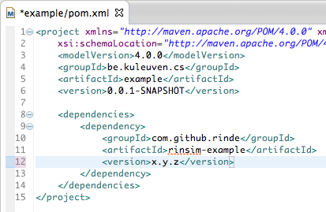
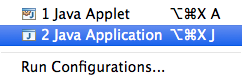
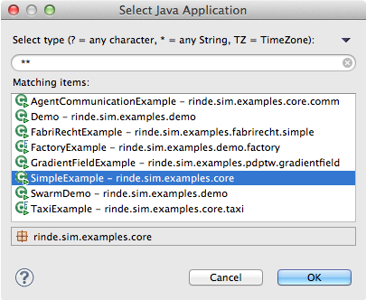

# How to run RinSim examples

Are you having trouble with running RinSim? See the [troubleshooting tips](#troubleshooting).
##Prerequisites: 

- __installed__ [Eclipse 4.2 or later](http://www.eclipse.org/)
- __installed__ [Maven plugin for Eclipse](http://www.eclipse.org/m2e/)

##Instructions:

1. Open Eclipse, choose ``File`` -> ``New`` -> ``Project...`` <br/> 
 
<br/><br/> 

2. Choose ``Maven Project`` and click ``Next >``<br/> 

<br/><br/>

3. Check ``Create a simple project (skip archetype selection)`` and click ``Next >``   
<br/><br/> 

4. For ``Group Id:`` choose a unique _personal_ identifier, often a reversed Internet domain name is used for this. For ``Artifact Id:`` choose an identifier for your project.<br/>
Click ``Finish``<br/>

<br/><br/> 

5. In your ``Package Explorer`` you should see the following: <br/>


6. Open the ``pom.xml`` file with the ``Maven POM Editor``. Choose the ``pom.xml`` tab in the bottom. <br/>

<br/>

7. You will see an XML view of the file. Paste the following XML between the ``project`` tags.
    ```xml
    <dependencies>
        <dependency>
            <groupId>com.github.rinde</groupId>
            <artifactId>rinsim-example</artifactId>
            <version>x.y.z</version>
        </dependency>
    </dependencies>

    <build>
		<plugins>
			<plugin>
				<groupId>org.apache.maven.plugins</groupId>
				<artifactId>maven-compiler-plugin</artifactId>
				<version>2.1</version>
				<configuration>
					<source>1.7</source>
					<target>1.7</target>
				</configuration>
			</plugin>
		</plugins>
	</build> 
    ``` 

8. Replace ``x.y.z`` with the current latest version (the latest version is shown [here](https://github.com/rinde/RinSim/)). The pom file should now look similar to this: <br/>

<br/><br/>

8. Maven will now start downloading the dependencies. When it is done, make sure your can find the ``rinsim-example-x.y.z.jar`` in your ``Package Explorer``:<br/>

<br/><br/>

9. Right click ``rinsim-example-x.y.z.jar`` -> ``Run As`` -> ``Java Application``<br/>

<br/><br/>

10. You will see the following window, select ``SimpleExample`` and click ``Ok``<br/>

<br/><br/>

11. You should now see the following window:<br/>
<br/>
Congratualations, Your setup is complete, you can start working with RinSim!
Click ``Control`` -> ``Play`` to start the simulation. For more information about the other available examples, click [here](../example/README.md)

__Protip__: you can download the sources of RinSim and all other dependencies by right clicking your project -> ``Maven`` -> ``Download Sources``

## Troubleshooting

- When Maven is complaining and you are sure you followed all instructions, force the Maven plugin to update. Right click on your project -> ``Maven`` -> ``Update Project..``.

- When Maven says it cannot find one of your dependencies and you are sure that you have configured your pom file correctly you can inspect your local Maven repository. The local maven repository is stored in your user folder: ``~/.m2/``. You can choose to delete the entire repository or only the dependencies that cause trouble. As soon as Maven detects that some dependencies are gone it will attempt to redownload them.

- When you have copied some RinSim code to your own project and you see a compile error such as 'the method/constructor is undefined' make sure that you didn't accidently use the 'organize imports' feature of Eclipse and selected the wrong class. E.g. choose ``rinde.sim.core.graph.Point`` over ``java.awt.Point``.

- When the compiler complains about ``@Override`` annotations in code that you have copied from RinSim, make sure that Maven targets Java version 1.6 or later (see step 7 in the instructions above for the XML code to do this).

- If you can not run the UI on Mac OS X make sure that you add ``-XstartOnFirstThread`` as a VM argument.