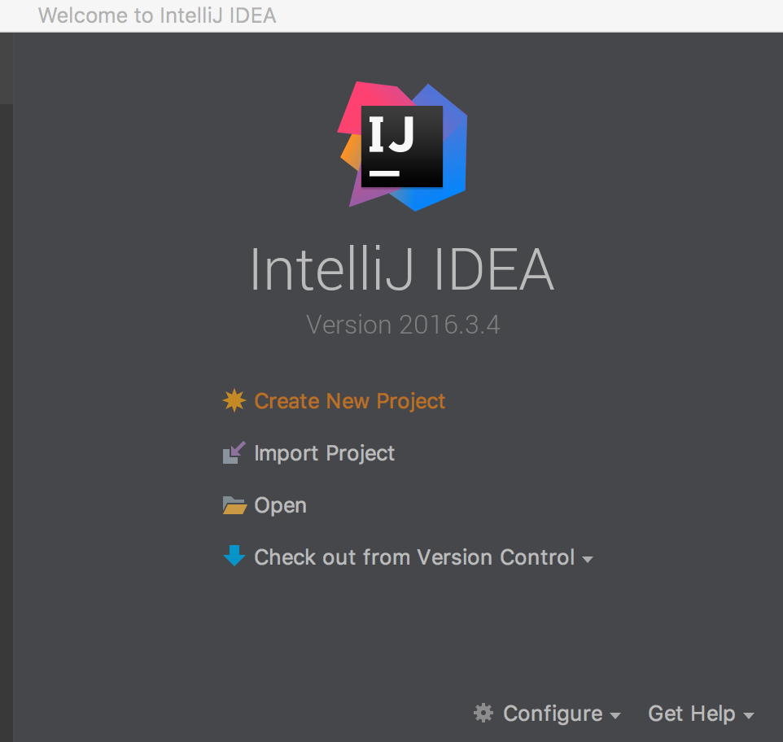
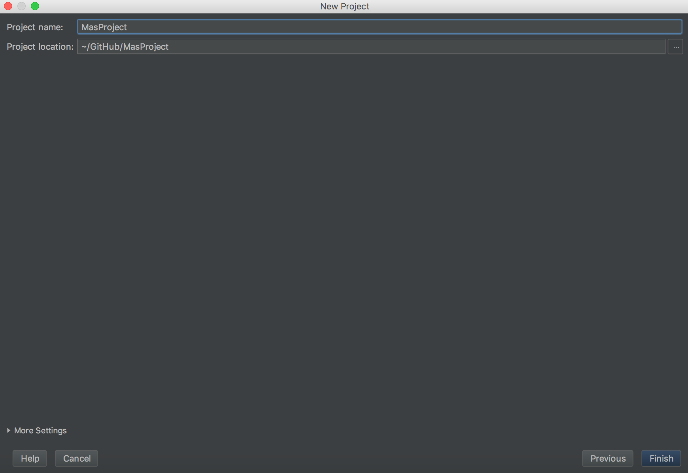
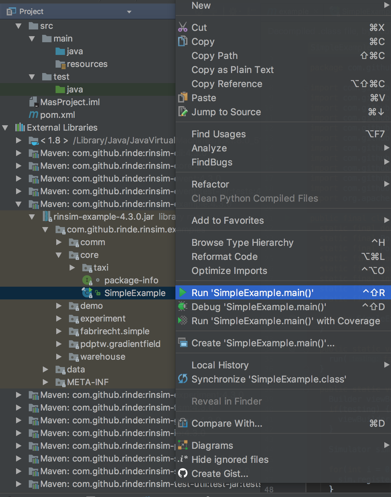

# How to run RinSim examples

Are you having trouble with running RinSim? See the [troubleshooting tips](#troubleshooting).
##Prerequisites: 

- __installed__ [IntelliJ IDEA](https://www.jetbrains.com/idea/)

##Instructions:

1. Open IntelliJ IDEA, choose ``Create New Project``<br/>


2. Choose ``Maven`` on the left and click ``Next >``<br/>


3. For ``Group Id:`` choose a unique _personal_ identifier, often a reversed Internet domain name is used for this. For ``Artifact Id:`` choose an identifier for your project.<br/>
Click ``Next``<br/>


4. Choose a name and a location for your project.<br/>
Click ``Finish``<br/>


5. In your ``Package Explorer`` you should see the following:<br/>
<br/>
Note that by default Maven uses (the ancient) Java 1.5. Since RinSim requires at least Java 1.7 we will change this in the next steps.

6. Open the ``pom.xml`` file.

7. You will see an XML view of the file. Add (paste) the following XML code between the ``project`` tags. Make sure to not overwrite the existing XML tags.
    ```xml
    <dependencies>
        <dependency>
            <groupId>com.github.rinde</groupId>
            <artifactId>rinsim-example</artifactId>
            <version>x.y.z</version>
        </dependency>
    </dependencies>

    <build>
		<plugins>
			<plugin>
				<groupId>org.apache.maven.plugins</groupId>
				<artifactId>maven-compiler-plugin</artifactId>
				<version>2.1</version>
				<configuration>
					<source>1.7</source>
					<target>1.7</target>
				</configuration>
			</plugin>
		</plugins>
	</build>
    ```

8. Replace ``x.y.z`` with the current latest version (the latest version is shown [here](https://github.com/rinde/RinSim/)). The pom file should now look similar to this:<br/>
<br/>
 Check that the ``JRE System Library`` as shown by Eclipse is version 1.7 (or higher), if this isn't the case it often helps to force Maven to update the project: right click on your project -> ``Maven`` -> ``Update Project..``. If that doesn't work it may be that Eclipse can't find a correct Java version in which case you need to update your Eclipse settings.

9. Maven will now start downloading the dependencies. When it is done, make sure your can find the ``rinsim-example-x.y.z.jar`` in your ``Project Explorer``:<br/>


10. Open ``rinsim-example-x.y.z.jar`` -> Find ``SimpleExample`` -> Right click -> ``Run 'SimpleExample.main()'``<br/>


11. You will see the following window. Select your project in ``Use classpath of module``. (If you are a Mac user, add ``-XstartOnFirstThread`` to ``VM options``, otherwise, just leave ``VM options`` empty) Click ``Apply`` and then ``Run``<br/>


12. You should now see the following window:<br/>
<br/>
Congratualations, Your setup is complete, you can start working with RinSim!
Click ``Control`` -> ``Play`` to start the simulation. For more information about the other available examples, click [here](../example/README.md).

__Protip__: you can download the sources of RinSim and all other dependencies by right clicking your project -> ``Maven`` -> ``Download Sources and Documentation``

## Troubleshooting

- When Maven is complaining and you are sure you followed all instructions, force the Maven plugin to update. Right click on your project -> ``Maven`` -> ``Reimport``.

- When Maven says it cannot find one of your dependencies and you are sure that you have configured your pom file correctly you can inspect your local Maven repository. The local maven repository is stored in your user folder: ``~/.m2/``. You can choose to delete the entire repository or only the dependencies that cause trouble. As soon as Maven detects that some dependencies are gone it will attempt to redownload them.

- When you have copied some RinSim code to your own project and you see a compile error such as 'the method/constructor is undefined' make sure that you didn't accidently use the 'organize imports' feature of Eclipse and selected the wrong class. E.g. choose ``rinde.sim.core.graph.Point`` over ``java.awt.Point``.

- When the compiler complains about ``@Override`` annotations in code that you have copied from RinSim, make sure that Maven targets Java version 1.7 or later (see step 7 in the instructions above for the XML code to do this).

- If you can not run the UI on Mac OS X make sure that you add ``-XstartOnFirstThread`` as a VM argument.

- On OS X Mavericks there may be a problem where you can not see the menu bar of RinSim (it usually shows the menu of Eclipse), if this happens it can be resolved by using a shortcut (e.g. CMD-P for play) or by CMD tabbing away and back to the RinSim app.

- If you have a problem with the SWT UI of RinSim on a 64-bit version of Windows while using IntelliJ IDEA, [see this StackOverflow thread](https://stackoverflow.com/questions/29793596/how-do-i-get-intellij-idea-to-import-rinsim-from-maven-correctly/) for a solution.